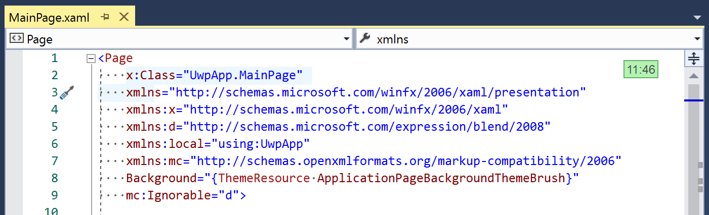

# ShowSelection

Download this extension from the [VS Gallery](https://marketplace.visualstudio.com/items?itemName=MattLaceyLtd.ShowSelection).

---------------------------------------

Shows the current selection points in the top right of the editor window.

See the [change log](CHANGELOG.md) for changes and road map.
